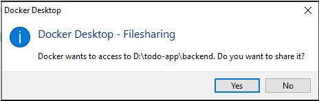
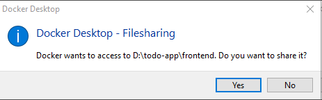
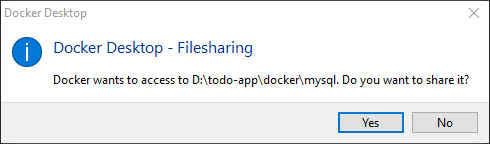
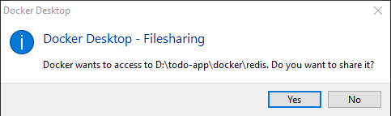

# To-Do Application

## Description

This is a To-Do application with a modern tech stack. It features:
- Backend: Laravel 11, providing a robust RESTful API.
- Frontend: Vue 3, utilizing the Quasar Framework to ensure a responsive and user-friendly interface.
- Database: MySQL is used as the database for storing tasks and user data.
- Containerization: The project is containerized using Docker, ensuring a seamless environment for development.

## Setup

To get the project up and running, follow these steps:

1. **Clone the Repository**

   First, clone the repository to your local machine:
   ```bash
   git clone https://github.com/arielaquin0/todo-app
   cd todo-app

2. **Build and Start Docker Containers**
   
   Run the setup.sh script to automatically build and start the required Docker containers. This will install dependencies, configure the environment, and launch the containers for the backend and frontend.
    ```bash
   ./setup.sh
    ```
   Note: If you are prompted with any of the four file sharing messages (as shown in the image below), click Yes to allow Docker to access your project files:
   
   
   
   
   
 
   This is necessary for Docker to share files between your local environment and the containerized application.


3. **Access the Application**

   Once the containers are up and running, navigate to the following URL in your browser to access the application:
    ```bash
   http://localhost:8000
